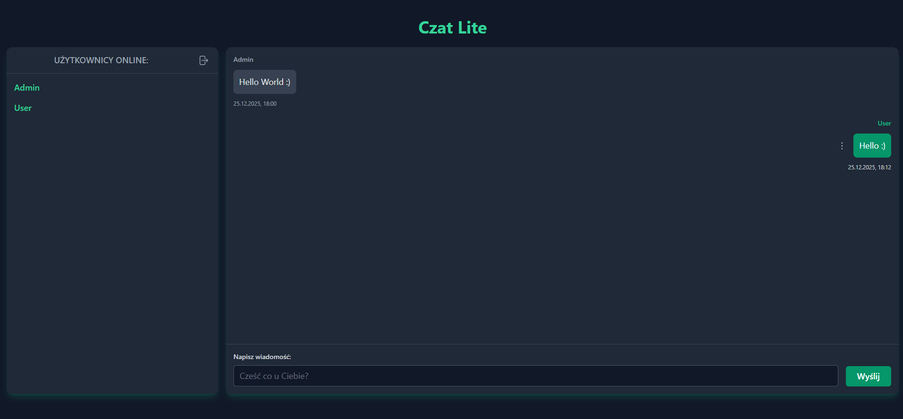

# Chat-app

### [Live Demo](https://chat-app-lh2l.onrender.com/)

A real-time chat application built with Vue 3 and Socket.io.



## Features

- JWT-based user login using a nickname
- Automatic user removal from the database on logout
- Real-time messaging via Socket.io
- Real-time typing indicator (`isTyping`)
- Message deletion by the author
- Persistent message storage in PostgreSQL
- Immutable author snapshot stored with each message to preserve chat history consistency

## Tech Stack

### Language

- TypeScript

### Frontend

- Vue 3
- Vite
- Tailwind CSS
- Pinia (state management)

### Backend

- Node.js
- Express.js
- Socket.io

### Shared Contracts

- Code-first DTOs

### Authentication

- JWT (JSON Web Tokens)

### Database

- PostgreSQL
- Prisma (ORM)

## Architecture Overview

The application uses a code-first DTO contract to define data structures for both HTTP and real-time Socket.io communication.

### User lifecycle

1. User logs in by providing a nickname.
2. A user entity is created and stored in the database.
3. Messages reference an immutable author snapshot (nickname at send time).
4. On logout, the user entity is removed from the database.
5. Message authors remain unchanged to preserve chat history integrity.

### Real-time flow

- Messages and typing indicators are handled via Socket.io.
- Socket events follow the code-first DTOs.
- The frontend uses Pinia to efficiently manage chat and UI state.

## Setup

To run this project, install it locally using npm:

#### Server

```bash
$ cd server
$ npm install
$ npm run dev

```

#### Client

```bash
$ cd client
$ npm install
$ npm run dev

```

#### Shared

```bash
$ cd shared
$ npm install
$ npm run build

```

## Design Decisions

- Code-first DTO contracts provide a single source of truth for communication data, simplifying development and ensuring consistency.

- Message authors are stored as immutable snapshots to preserve chat history consistency.
  User entities are intentionally removed on logout as a project simplification, allowing the data model to focus on real-time behavior rather than long-lived user accounts.

- Pinia store used to optimize frontend state handling and reduce unnecessary reactivity.

- Strict TypeScript usage across all layers to minimize runtime errors and improve maintainability.

- This project was built as a portfolio application to demonstrate practical experience with real-time systems, typed contracts, and full-stack TypeScript architecture.
